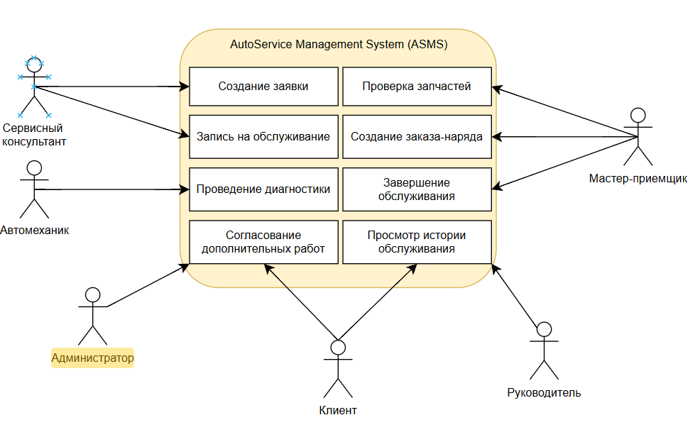

# Use Case Diagram

Диаграмма вариантов использования отображает основные сценарии
взаимодействия пользователей с системой AutoService Management System.

Основными акторами системы являются:

- Клиент;
- Сервисный консультант;
- Мастер-приёмщик;
- Автомеханик;
- Руководитель;
- Администратор.

Диаграмма построена на основе Use Cases UC-001 — UC-008.

